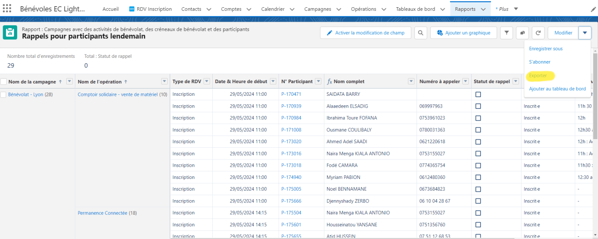
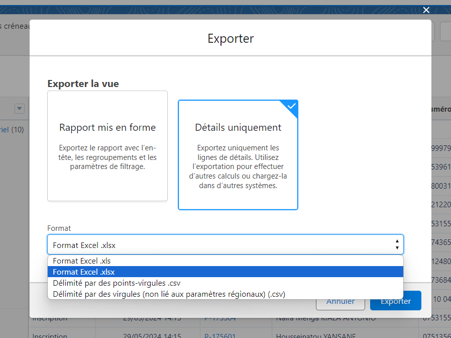
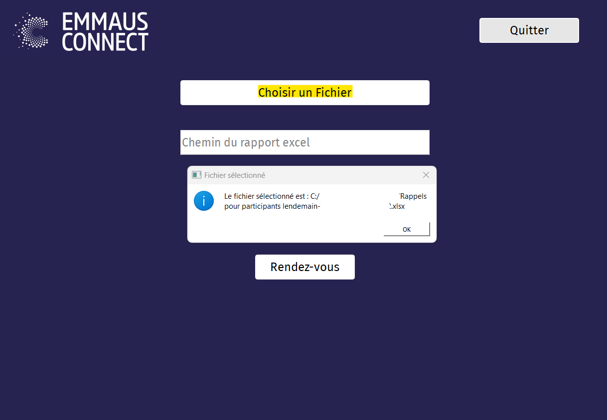
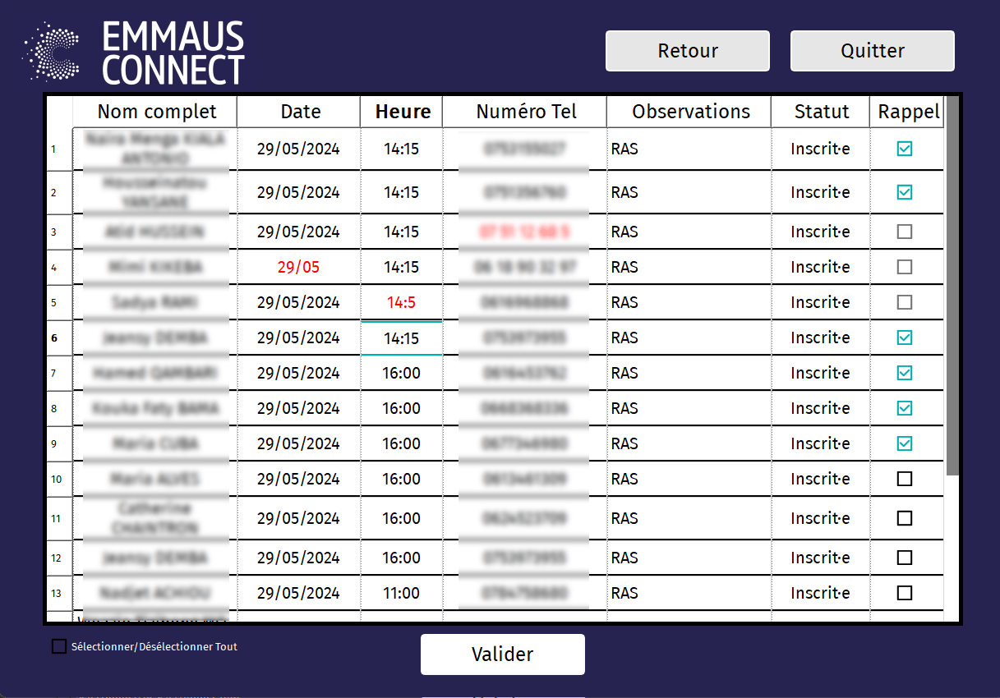
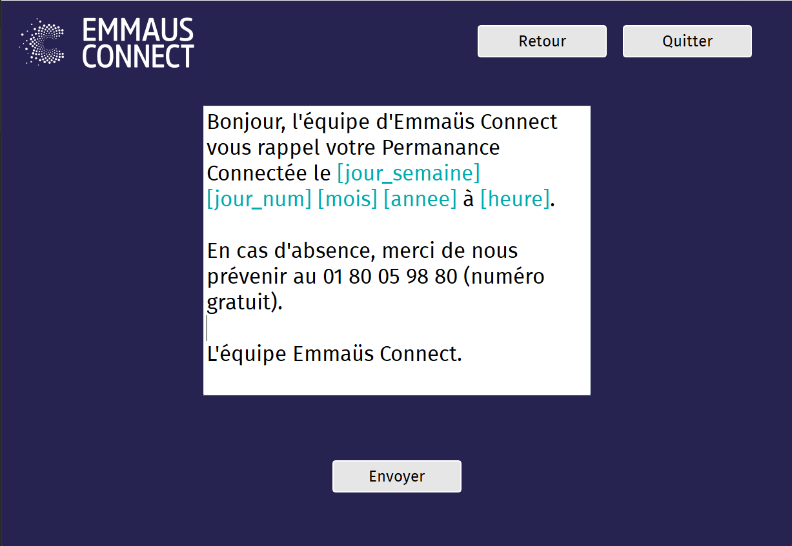
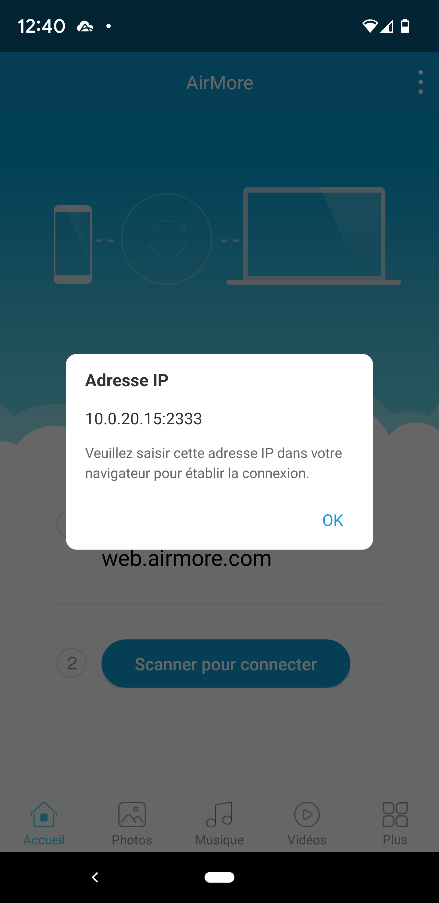
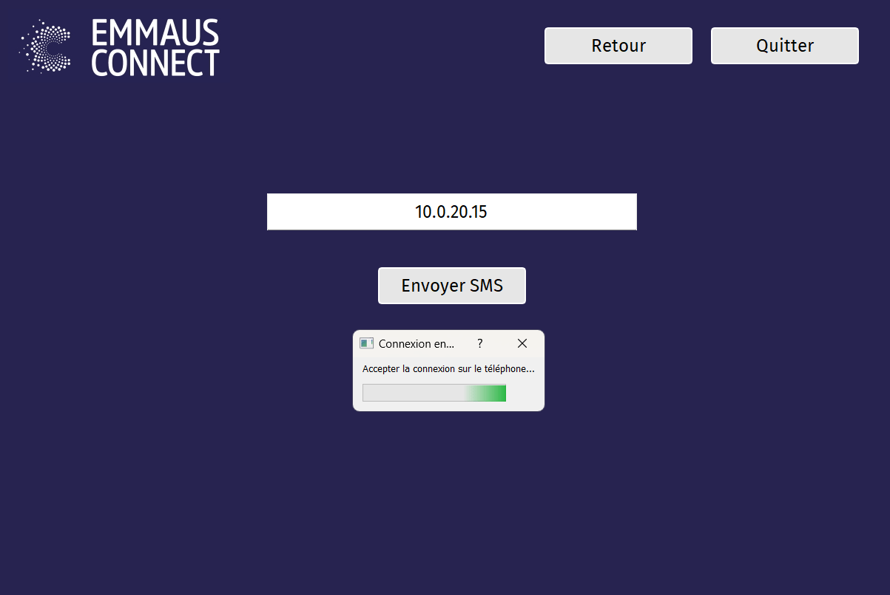
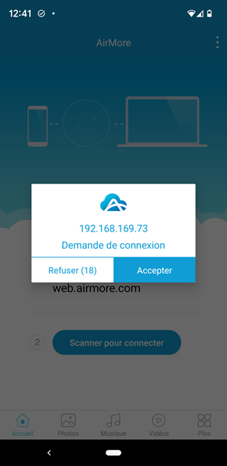

# Auto_Rappel-Emmaüs-Connect

## Installation

### Ordinateur
Téléchargez le dossier complet et décompressez-le dans `C:/Program Files`.
Dans le dossier, faites un clic droit sur `Auto_Rappel_V2.exe` -> créez un raccourci -> ajoutez-le sur le bureau.

NB : Il se peut que Windows détecte un virus dans le dossier et bloque l'accès au fichier `.exe`. Désactivez simplement l'antivirus et redécompressez l'archive dans le dossier.

### Téléphone
Sur le téléphone (Android uniquement), téléchargez le fichier `Airemore.apk`.
Ouvrez le fichier et suivez les instructions d'installation.

NB : Le téléphone peut demander d'autoriser l'installation d'applications de sources inconnues. Rendez-vous dans les paramètres du téléphone et recherchez "sources inconnues". Activez l'option `autoriser l'installation de sources inconnues` puis recommencez le processus d'installation de l'application.

## Utilisation

### Télécharger le rapport

Sur SalesForce, rendez-vous dans `Rapport` -> `Rappel pour participant lendemain`.
Sélectionnez la flèche en haut à droite puis `Exporter`.
Choisissez `Détail uniquement` -> Format `Excel .xlsx`, puis `Exporter`.

NB : Il est important de bien choisir le format `.xlsx` et non pas `.xls`.

### Sélectionner le rapport précédemment téléchargé

Ouvrez l'application et cliquez sur `Choisir un fichier`. 
Une page d'arborescence Windows s'ouvre et vous pouvez sélectionner le rapport précédemment téléchargé.
Une fois le fichier sélectionné, une popup s'ouvre vous indiquant que le fichier a bien été sélectionné.

### Sélectionner les contacts

Une fois le fichier sélectionné, le chemin de ce dernier devrait apparaître dans le champ de texte. Si ce n'est pas le cas, revérifiez les étapes précédentes et assurez-vous qu'il s'agit du bon fichier.

Choisissez le type de rappel que vous souhaitez effectuer (Permanence Connectée, Parcours d'initiation, Rendez-vous bénéficiaire) et cliquez sur le bouton associé.

Sélectionnez les contacts pour qui vous souhaitez envoyer un SMS.

Si la date, l'heure ou le numéro de téléphone ne sont pas valides, le contact ne peut pas être sélectionné et l'information faisant défaut est indiquée en rouge.
Pour modifier une valeur, il suffit de double-cliquer dessus pour pouvoir l'éditer.

Une fois tous les contacts sélectionnés, cliquez sur `Valider`.

NB : Le fichier .xlsx ne doit être ouvert dans aucune autre application

### Édition du message

L'application ouvre alors la page d'édition du message qui sera envoyé à tous les contacts sélectionnés.

Le message est sauvegardé à chaque modification et reste permanent à la réouverture de l'application.

Les messages peuvent inclure des valeurs variables exportées du fichier de rappel et indépendantes pour chaque contact. Ces valeurs peuvent être renseignées grâce à des mots-clés entre crochets.

|      | Mot-clé | Attribution |
|:-:|:-:|:-:|
| 	&#x1F4DE; | [Tel] | Numéro de téléphone du contact |
| 	&#x1F4C5; | [Date] | Date du rendez-vous (format jj/mm/aaaa) |
| 	&#x1F558; | [Heure] | Heure du rendez-vous |
| 	&#x1F600; | [prenom] | Prénom du contact |
| 	&#x1F6C3; | [nom] | Nom du contact |
| 	&#x1F4C6; | [jour_semaine] | Jour du rendez-vous (jour de la semaine : format littéral) |
|   &#x1F5D3; | [jour_num] | Jour du rendez-vous (jour du mois : format numérique) |
| 	&#x1F313; | [mois] | Mois du rendez-vous (format littéral) |
| 	&#x1F38A; | [annee] | Année du rendez-vous (format numérique) |

Une fois les modifications effectuées, cliquez sur Envoyer.

### Connecter le téléphone

Sur le smartphone, ouvrez l'application "Airemore".

En haut à droite du téléphone, cliquez sur  &#8942;  -> `Adresse IP` et renseignez l'adresse IP du téléphone (sans le ":2333") dans le champ de texte sur l'ordinateur puis cliquez sur Envoyer.

Une boîte de dialogue s'ouvre sur le téléphone et demande l'autorisation de se connecter : cliquez sur Confirmer.

Un message de confirmation apparaît vous informant que tous les SMS ont été envoyés.

Vérifiez que les SMS ont bien été envoyés dans l'application Messages sur le téléphone.

Fermez la boîte de dialogue sur l'ordinateur pour retourner au menu et répétez les différentes opérations pour chaque type de rendez-vous.

NB : En cas d'erreur, vérifiez que l'adresse IP saisie est correcte et que le téléphone et l'ordinateur sont connectés sur le même réseau WiFi.

NB : Des boîtes de dialogue peuvent s'ouvrir sur le téléphone et demander la confirmation d'envoi de plusieurs SMS, cliquez sur Oui.

  